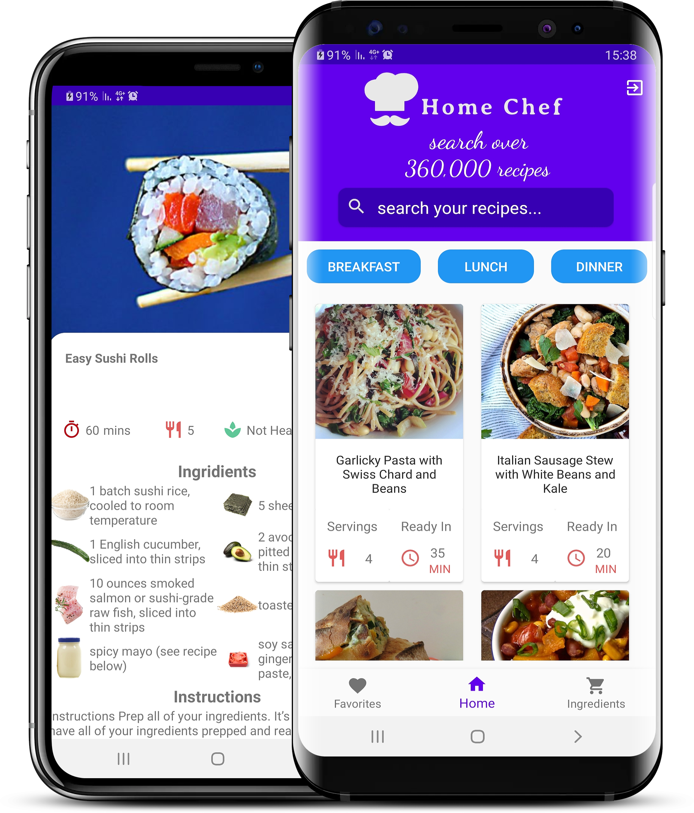

# Cookbook
TTS를 통해 레시피를 읽어주어서 요리 도중 휴대폰을 만질 일이 없도록 한다.

### Features
* Easy to Use
* Search recipes by ingredients or title
* Save your favorite recipes
* Filter recipes by type of meal
* Login to your account from any device
* Completely free and ad-free

### Technologies
* Java
* Android Studio
* Spoonacular API
* Firebase

### 참고 오픈소스
* Home Chef

Home Chef is the best solution for people who are bored of the cooking the same four meals every week or tired of ordering food. It is an android application that offers over 360,000 different recipes using <a href=https://spoonacular.com/food-api>Spoonacular API</a>.  
With Home Chef the user can see a random recipes, search recipies by ingredients that are available at home and more.

